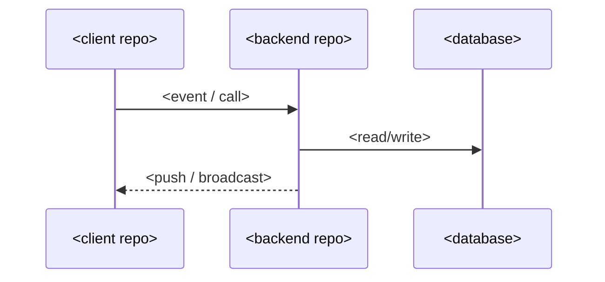

# <Feature / topic name>

> As-built documentation, derived from code — <YYYY-MM-DD>. Items marked `TODO(verify: ...)` are unconfirmed.

## Overview

<!-- What it does and for whom, 3-4 sentences. Present tense, describing reality — not intent. -->

## Repos involved

<!-- One row per repo that participates. -->

| Repo | Role in this feature | Key files |
|---|---|---|
| | | |

## How it works

<!-- Numbered end-to-end flow: trigger → transport → storage → notification. Every step cites the file/symbol it was read from. Include a Mermaid sequenceDiagram of the flow: -->

## Data model

<!-- Collections/tables and fields this feature reads/writes. Flag any models duplicated across repos and any drift you observed (e.g. type differences). `erDiagram` optional if the shape is non-trivial. -->

## Contracts

<!-- REST endpoints, realtime events, push payload shapes consumed by clients. Exact paths/event names as coded. -->

## Configuration & environments

<!-- Env vars, feature flags, plan gating, env-dependent behavior (e.g. production-only checks). -->

## Known gaps & gotchas

<!-- From the repo reference files plus what code reading revealed. State known gaps honestly, with tracking ids if your team uses them — this doc describes reality. -->

## Source pointers

<!-- The repo-relative paths + symbols backing the claims above, so a reader can verify. No line numbers (they rot). -->

## Related docs

<!-- ADRs, design docs, other knowledge-base pages, legacy external doc links. -->
