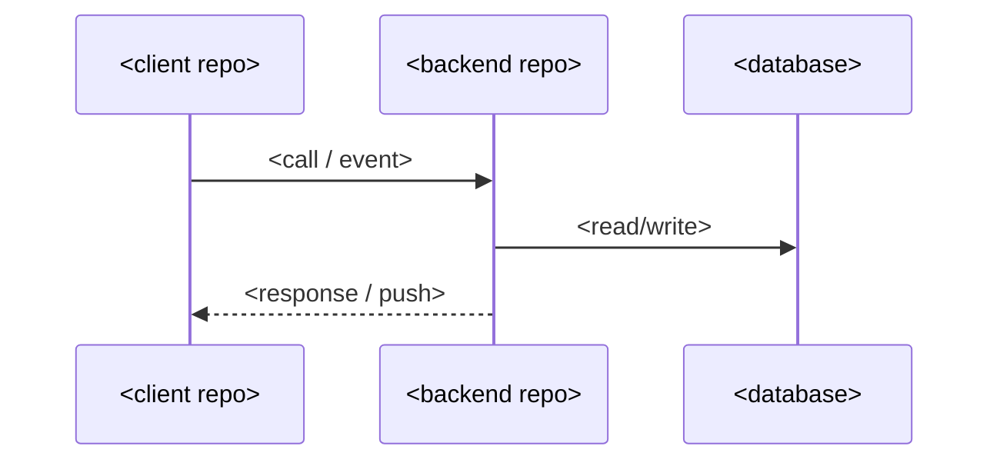

# <Feature title>

> Status: Draft — <YYYY-MM-DD>. Ticket: <TICKET-ID or "none">.

## Summary

<!-- 2-3 sentences: what is being built and why. A reader should be able to stop here and know the gist. -->

## Problem & goals

<!-- The user/product problem being solved. Measurable goals where possible. Pull from the Linear ticket if one exists. -->

## Non-goals

<!-- Explicit scope cuts — what this deliberately does NOT cover. -->

## Current state

<!-- How the involved repos behave today, with source pointers (repo-relative path + symbol). Cite what you actually read; mark anything unverified as TODO(verify: ...). -->

## Proposed design

<!-- The design itself. Include a Mermaid diagram: `sequenceDiagram` for cross-repo/message flows, `flowchart TD` for logic/state. Example skeleton: -->

## Cross-repo impact

<!-- REQUIRED. One row per repo in the workspace — mark untouched repos "none". -->

| Repo | Changes needed | Contract touched | Risk |
|---|---|---|---|
| `<repo-1>` | | | |
| `<repo-2>` | | | |

## Data model changes

<!-- Collections/tables/fields added or changed. If any models are duplicated across repos rather than shared via a package, spell out which copies change. -->

## API & event contract changes

<!-- REST endpoints, realtime events, push payload shapes — old vs new. Exact paths/event names, matching the code's casing. -->

## Privacy & security

<!-- REQUIRED for anything touching sensitive data, notifications, or billing. Who can see whose data? What auth/membership checks gate the new surface? Does it interact with any known gaps documented in the review references? -->

## Rollout & sequencing

<!-- REQUIRED. If any client cannot be force-upgraded (e.g. a mobile app with store review lag), backends must ship backward-compatible first. Give the deploy order across repos and what stays compatible in between. -->

## Alternatives considered

<!-- Brief. If the choice is architectural and long-lived, promote it to an ADR (decisions/) and link it here instead. -->

## Open questions

<!-- Anything unresolved that review should settle. -->
