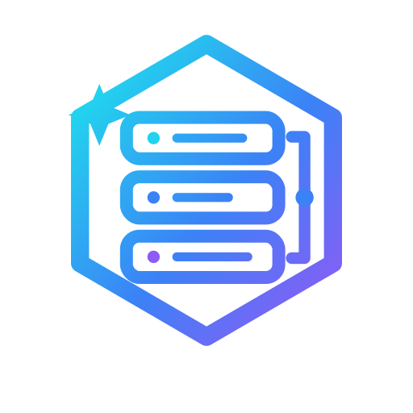

<div align="center">

<picture>
  <source media="(prefers-color-scheme: dark)" srcset="assets/devrig-logo-dark.png">
  
</picture>

**One rig for all your repos — an AI-ready, multi-repo dev workspace template.**

[](https://www.npmjs.com/package/create-devrig)
[](https://github.com/lakpriya1s/devrig/generate)
[](LICENSE)
[](CONTRIBUTING.md)

**English** · [简体中文](docs/README.zh-CN.md) · [Español](docs/README.es.md) · [हिन्दी](docs/README.hi.md) · [Português](docs/README.pt-BR.md) · [日本語](docs/README.ja.md) · [Français](docs/README.fr.md) · [한국어](docs/README.ko.md) · [සිංහල](docs/README.si.md)

</div>

---

## What is devrig?

devrig is a *meta-repo*: one folder that contains every repo of your project
**plus** the AI tooling used to develop across them. This repo versions only
the tooling — your project repos are cloned side-by-side by `setup.sh` and
stay untracked. Everything is configured from a single **`devrig.toml`** file.

| | What you get |
|---|---|
| 🧠 | **AI workflow skills** — `/start-task`, `/raise-pr`, `/code-review`, `/write-doc`, `/create-ticket` (agent-agnostic in `.agents/skills/`, symlinked for Claude Code, opencode configured too) |
| 🔍 | **[semble](https://github.com/MinishLab/semble)** — semantic code search agents use via MCP instead of grep-and-read |
| ⚡ | **[rtk](https://github.com/rtk-ai/rtk)** — token-optimizing command proxy for Claude Code |
| 🎫 | **Issue tracker MCP** — Linear, Jira, or bring your own; picked interactively by `setup.sh` |
| 🛡️ | **Protected-branch git hooks** — no accidental commits/pushes to your default branch, in any repo |
| 📚 | **`knowledge/`** — a markdown knowledge base skeleton (architecture, ADRs, design docs, runbooks) the AI tooling indexes and writes into |
| 🖥️ | **Generated VS Code multi-root workspace** — every repo in one window |

## Quick start

The fastest way — one command, no cloning:

```bash
npx create-devrig my-project
```

[`create-devrig`](https://github.com/lakpriya1s/create-devrig) fetches this
template (no git history), initializes a fresh git repo in `my-project/`, and
launches the interactive setup wizard immediately — same wizard described
below, just without the separate clone step.

Prefer GitHub's UI, or want the repo created under your org from the start?

1. Click **[Use this template](https://github.com/lakpriya1s/devrig/generate)** to create `your-org/your-project-workspace`.
2. Clone it and run:

   ```bash
   ./setup.sh
   ```

   The first run notices `devrig.toml` still has the shipped example values and
   walks you through configuring it interactively: project name, GitHub org,
   the repos to clone (paste several at once, space- or comma-separated),
   your issue tracker (**Linear**, **Jira**, or **other** — pick one from a
   menu), ticket prefix, default branch, and feature toggles. It then writes
   `devrig.toml` for you. Prefer to hand-edit instead? Fill in `devrig.toml` yourself
   before running the script and it'll skip the prompts.
3. Run `claude` from this folder and start working.

Either way, inside Claude Code: run `/mcp` and authenticate the tracker server
that was configured (**linear** or **atlassian**; one-time OAuth — **semble**
needs no auth), and restart Claude Code once so the rtk hook takes effect.

## 🤖 Kickstart with your AI agent

### Already have your repos?

Just created a workspace from this template? Paste this into your AI coding
agent (Claude Code, Cursor, opencode, …) and let it finish the setup with you:

```text
I just created a workspace from the devrig template
(https://github.com/lakpriya1s/devrig). Help me set it up:

1. Read README.md and AGENTS.md to understand the workspace.
2. Run ./setup.sh with me, relaying its interactive prompts (project name,
   GitHub org, repos, issue tracker, ticket prefix, default branch, feature
   toggles) so I can answer them — then help me fix anything it flags.
3. Work through the README's "Customization checklist" section with me.
4. Commit the personalization on a task branch and open a PR.
```

### Starting a brand-new project?

No repos yet, just an idea? Swap in your project description where marked
and paste this instead — the agent takes you from idea to a running
workspace, new repos included:

```text
I want to start a brand-new project using the devrig template
(https://github.com/lakpriya1s/devrig). Here's what I'm building:

[describe your project — what it does, who it's for, and any stack or
platform preferences you already have]

Help me go from this description to a working workspace:

1. Run `npx create-devrig <name>` to scaffold the workspace (pick a short
   project name from my description if I haven't given one).
2. Propose a repo breakdown and stack for each piece based on what I'm
   building — confirm with me before creating anything.
3. Create each repo on GitHub under my org (ask which) and scaffold it
   with its framework's starter command, committing the initial code.
4. Fill in devrig.toml (project name, org, the repos we just created,
   issue tracker, ticket prefix, default branch — make sure it matches
   what the new repos actually use) and run ./setup.sh.
5. Fill in AGENTS.md's Systems table since you already know each stack.
```

## What setup.sh does

`setup.sh` is idempotent — re-run it anytime to update every repo and tool. It:

0. **First run only**: if `devrig.toml` still has the shipped example values,
   prompts for all of the values below interactively and writes `devrig.toml`.
1. Checks prerequisites (`git`, `gh` authenticated; installs `uv` if semble is enabled).
2. Clones every repo in `repos` side-by-side (or fast-forwards clean
   default-branch checkouts), and excludes them from this repo's git status
   via `.git/info/exclude`.
3. Installs the protected-branch git hooks into this repo and every cloned repo.
4. Converges `.mcp.json` / `opencode.json` to your `devrig.toml` toggles — adding
   the `linear` or `atlassian` (Jira) server per `issue_tracker`, or neither
   if you picked "other" — while preserving any MCP servers you added by
   hand, and generates `.claude/settings.local.json`.
5. Installs semble and warms a search index per repo.
6. Installs rtk and registers its Claude Code hook.
7. Generates `<project>.code-workspace` for VS Code (skipped if you already
   have one, so it's safe to customize and commit).

## Customization checklist

After the first `setup.sh` run, make your personalization commit:

- [ ] `devrig.toml` — `setup.sh` prompts for these interactively on first run (or
      hand-edit the file before running it, and it'll skip the prompts). To
      change values later — switch tracker, add a repo — edit `devrig.toml`
      directly and re-run `./setup.sh`.
- [ ] `AGENTS.md` — fill the **Systems** table (one row per repo: what it is,
      stack) and the **Testing** section. This is the source of truth every
      skill reads.
- [ ] `.agents/skills/code-review/references/` and
      `.agents/skills/write-doc/references/` — one reference file per repo
      (copy `_example-repo.md`). The skills work without them but get much
      sharper with them.
- [ ] If `issue_tracker` is `linear`: verify `.agents/skills/create-ticket/SKILL.md`'s
      "Conventions" table against your Linear workspace (teams, projects, labels).
      If it's `jira` or `other`: adapt `/start-task`, `/raise-pr`, and
      `/create-ticket`'s `mcp__linear__*` calls to your tracker's MCP tool names
      (each skill flags this at the top).
- [ ] Delete or adjust anything a toggle disabled (e.g. remove the semble
      notes from `CLAUDE.md` if you don't use it).

## Layout

| Path | What it is |
|---|---|
| `devrig.toml` | Your project config — the one file every tool reads |
| `setup.sh` | Idempotent bootstrap/update script |
| `AGENTS.md` | Agent-agnostic source of truth (systems, branch rules, conventions) |
| `CLAUDE.md` | Claude Code specifics; imports `AGENTS.md` |
| `.agents/skills/` | Canonical workflow skills (agent-agnostic) |
| `.claude/` | Claude Code settings, agents, skill symlinks |
| `.opencode/` | opencode agents and plugin config |
| `.mcp.json` / `opencode.json` | MCP servers (issue tracker, semble) |
| `git-hooks/` | Protected-branch pre-commit / pre-push hooks |
| `knowledge/` | Markdown knowledge base (architecture, decisions, design, runbooks, product, releases) |
| `<repo>/` (untracked) | Your project repos, cloned by `setup.sh` |

## Adding a skill

See [`.agents/skills/_template/README.md`](.agents/skills/_template/README.md).
Short version: create `.agents/skills/<name>/SKILL.md`, symlink it into
`.claude/skills/`, and list it in `CLAUDE.md`.

## Knowledge base

New design docs, architecture notes, ADRs, and runbooks go in
[`knowledge/`](knowledge/) as markdown via PR — semble indexes it, so agents
find design context the same way they find code. When it outgrows this repo,
push it as a separate `<project>-knowledge` repo, add that to `repos` in
`devrig.toml`, delete the folder here, and update the pointer in `AGENTS.md`.

## Troubleshooting

- **`semble` or `uv` not found after setup** — open a new shell (PATH was
  updated) and re-run `./setup.sh`.
- **Tracker tools missing in Claude** — run `/mcp` and complete the OAuth flow
  for the `linear` or `atlassian` server.
- **rtk not kicking in** — restart Claude Code; verify with `rtk gain` that
  commands are being proxied.
- **A repo won't update** — `setup.sh` never touches a repo that has local
  changes or is on a task branch; it only fast-forwards clean default-branch
  checkouts.
- **setup.sh isn't prompting me, it just fails with "edit devrig.toml first"** —
  it only prompts when attached to an interactive terminal; running it from
  a script or CI falls back to requiring `devrig.toml` to already be filled in.
- **Picked Jira or "other"** — the `atlassian` MCP server (Jira) is wired up
  automatically, but `/start-task`, `/raise-pr`, and `/create-ticket` still
  call Linear's MCP tool names — `setup.sh` will warn you about this at the
  end of every run until you adapt those skills.

## Contributing

devrig gets better with every team that rigs it up. Bug reports, new generic
skills, better docs, and **README translations** are all very welcome — see
[CONTRIBUTING.md](CONTRIBUTING.md). If devrig saved your team setup time,
a ⭐ helps others find it.

## License & citation

Released under the [MIT License](LICENSE).

If you use devrig in your work or writing, a citation is appreciated — GitHub's
**"Cite this repository"** button (powered by [`CITATION.cff`](CITATION.cff))
has the details, or:

> Senevirathna, L. (2026). *devrig: a multi-repo AI dev workspace template.*
> https://github.com/lakpriya1s/devrig

<div align="center">
<sub>Built from a production multi-repo workspace ·  devrig</sub>
</div>
