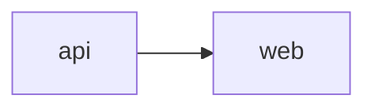

# System Map

> Generated from `.ai/systems.yaml` by `scripts/generate-architecture-views.mjs`.
> Do not edit by hand — edit the source file and regenerate. `authority: generated`:
> treat this as a lead to verify, not a citation (see `knowledge/README.md`).

## Dependency graph

## Systems

| System | Repo | Purpose | Stack | Depends on |
|---|---|---|---|---|
| api | example-api | Backend API | nestjs, postgresql | — |
| web | example-web | Web frontend | nextjs, tailwind | api |
